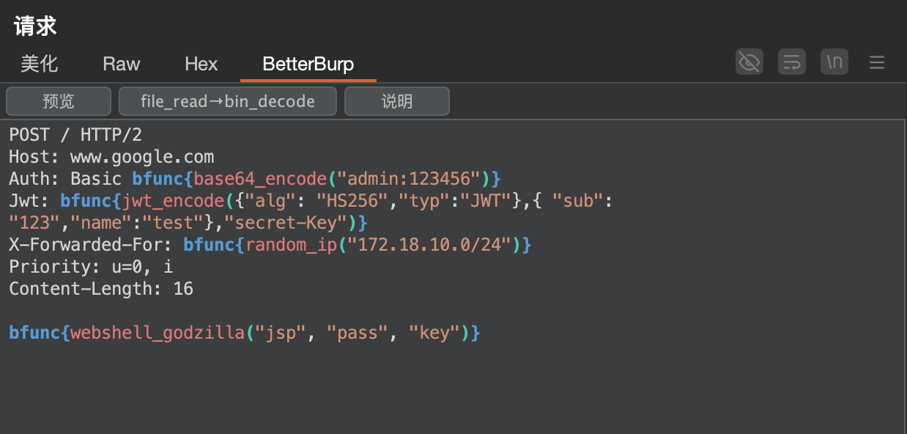
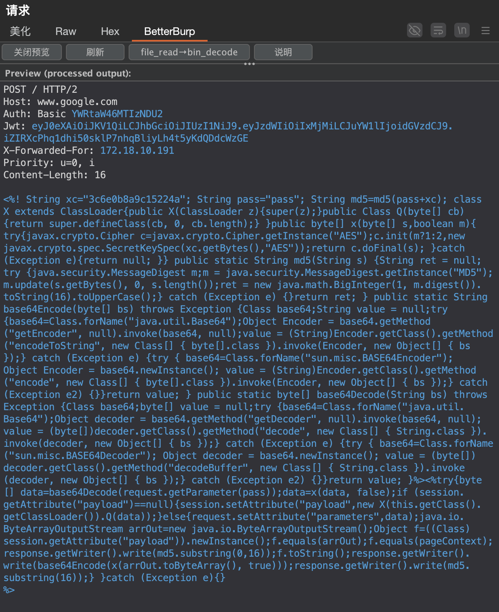
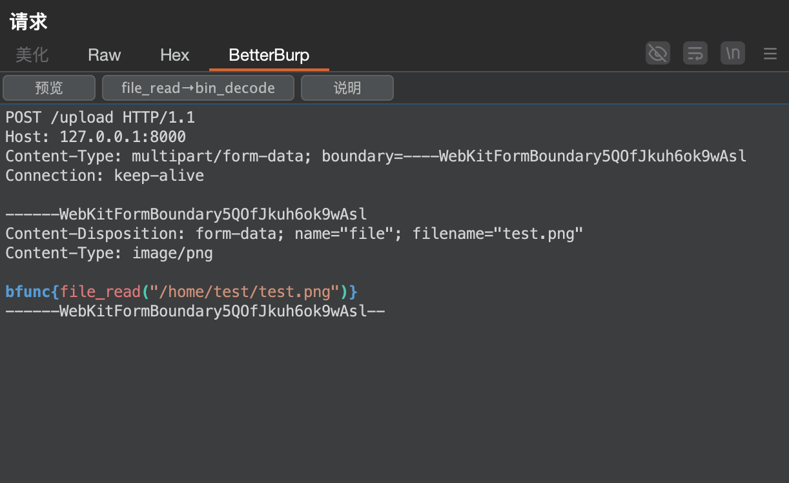
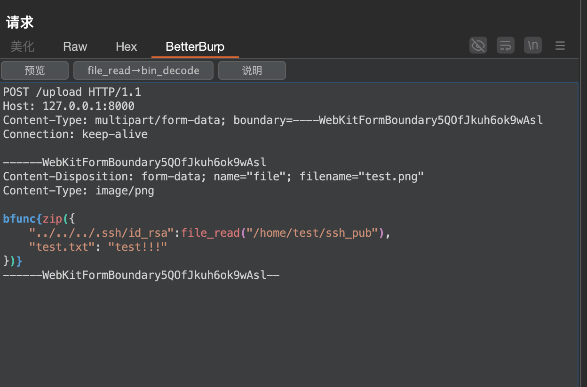
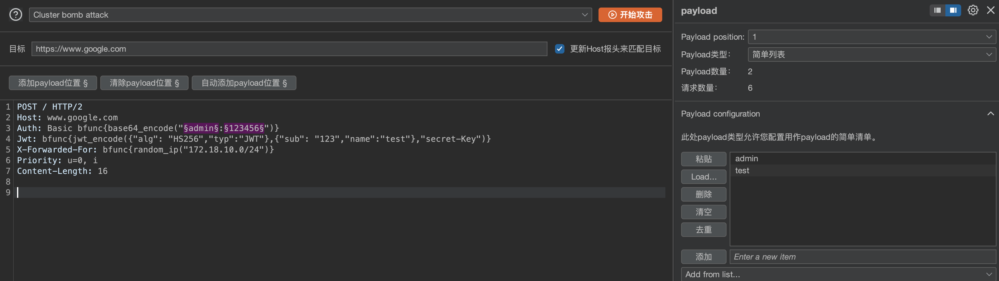
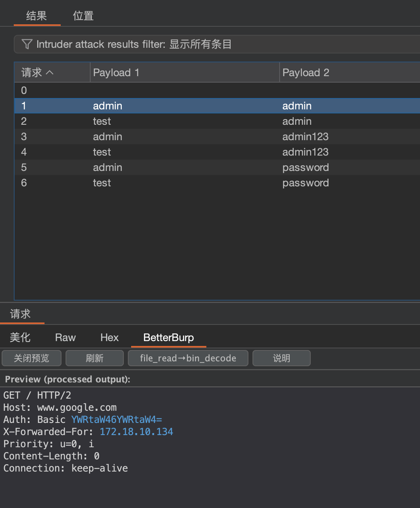
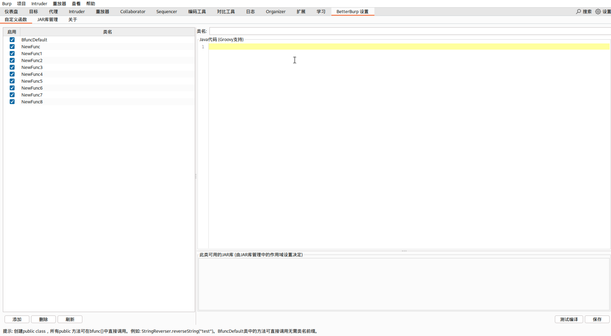
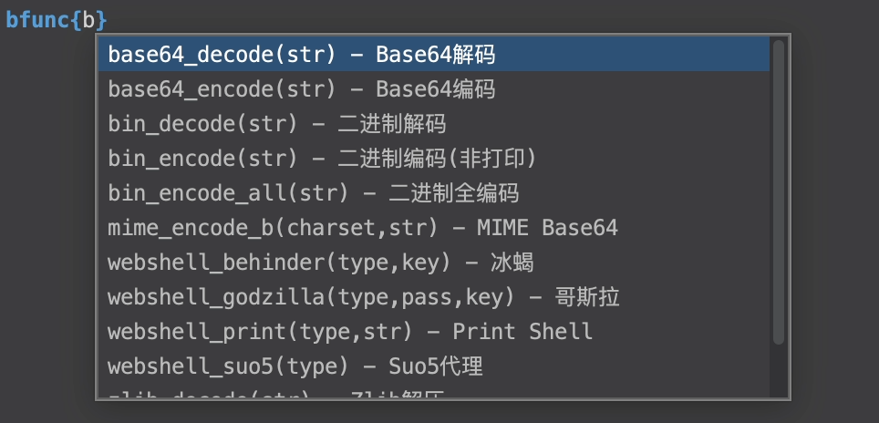

# BetterBurp

## 介绍

本插件灵感来源于 Yakit。想利用类似内涵表达式的方式让 Burp 跟方便。支持在 Repeater 和 Intruder 中使用 `bfunc{}` 模板表达式进行实时负载生成。可以在 BetterBurp 页面导入 jar 包，和添加自定义方法。

**注意：因为使用的是 GROOVY 表达式引擎，导入别人的链接或者库不一定可信，请仔细鉴别，一定要检查后再预览或者发送！！！** 

## 用法

### 基本用法

你可以在你的 Repeater 或者 Intruder 中插入 `bfunc{}` 表达式



可以在预览窗口中查看



### 文件上传

Burp在文件上传时候直接右键导入的文件如果文件是二进制的，就会乱码。使用这个插件可以直接插入文件或者路径穿越的zip包。

上传文件



构造路径穿越zip包（现在已经从`{}`​转换为`[]`）。



### 爆破

如果要爆破tomcat就可以使用下面这种方式





## 详细函数说明

```plaintext
【语法说明】
使用 Groovy 表达式引擎，支持：
  字符串: "hello" 或 'hello'
  数字: 123, 45.67
  字符串拼接: "a" + "b" → "ab"
  数字运算: 100 + 200 → 300
  函数嵌套: md5("test" + "123")

【编码函数】
base64_encode(str)     - Base64 编码
base64_decode(str)     - Base64 解码
hex_encode(str)        - 十六进制编码
hex_decode(str)        - 十六进制解码
url_encode(str)        - URL 编码（保留字母数字）
url_encode_all(str)    - URL 编码（全部字符）
url_decode(str)        - URL 解码
unicode_encode(str)    - Unicode 编码 (\uXXXX)
unicode_encode(map)    - Unicode 编码 Map
  示例: unicode_encode(["aaa":"bbb"]) → {"\u0061...":"\u0062..."}
unicode_decode(str)    - Unicode 解码
gzip_encode(str)       - Gzip 压缩
gzip_decode(str)       - Gzip 解压
zlib_encode(str)       - Zlib 压缩
zlib_decode(str)       - Zlib 解压
zip(map)               - 创建 ZIP 文件
  示例: zip(["test.txt":"hello", "test.bin":base64_decode("xxxx")])
  示例: zip(["test.txt":file_read("/home/1.txt")])
  路径穿越: zip(["../../../.ssh/id_rsa":"key"])
html_encode(str)       - HTML 实体编码（十进制）
html_encode_16(str)    - HTML 实体编码（十六进制）
html_decode(str)       - HTML 实体解码
bin_encode(str)        - 二进制编码（非打印字符）
bin_encode_all(str)    - 二进制编码（全部字符）
bin_decode(str)        - 二进制解码

【哈希函数】
md5(str)               - MD5 哈希
sha1(str)              - SHA-1 哈希
sha256(str)            - SHA-256 哈希
sha512(str)            - SHA-512 哈希

【时间函数】
time()                 - 当前 Unix 时间戳（秒）
time_ms()              - 当前时间戳（毫秒）
time_random()          - 随机时间戳（前10年到当前）
time_ms_random()       - 随机毫秒时间戳

【随机函数】
random_uuid()          - 生成随机 UUID
random_str(min, max)   - 随机字符串 (A-Z, a-z, 0-9)
random_ip("")          - 随机 IP 地址
random_ip("cidr")      - 指定网段随机 IP
  示例: random_ip("192.168.1.0/24")

【字符串函数】
to_upper(str)          - 转大写
to_lower(str)          - 转小写
to_random(str)         - 随机大小写
len(str)               - 字符串长度

【文件函数】
file_read(path)        - 读取文件内容

【MIME/字符集函数】
mime_encode_b(charset, str) - MIME Base64 编码
  示例: mime_encode_b("utf-8", "test")
mime_encode_q(charset, str) - MIME QP 编码
encode(charset, str)   - 字符集编码
  示例: encode("gbk", "中文")

【Webshell 函数】
webshell_print(type, str) - 生成 print webshell
  类型: jsp, jspx, asp, aspx, ashx, php
webshell_godzilla(type, pass, key) - 生成 Godzilla webshell
  类型: jsp, jspx, asp, aspx, ashx, php
  示例: webshell_godzilla("jsp", "pass", "key")
webshell_behinder(type, key) - 生成 Behinder webshell
  类型: jsp, aspx, ashx, php
  示例: webshell_behinder("jsp", "rebeyond")
webshell_suo5(type) - 生成 Suo5 代理 webshell
  类型: jsp, aspx, php
  示例: webshell_suo5("jsp")
  key 会取 MD5 前16位

【JWT 函数】
jwt_encode(header, payload, secret) - 生成 JWT
  支持算法: HS256, HS384, HS512, none
  示例: jwt_encode(
    ["alg":"HS256","typ":"JWT"],
    ["sub":"123","name":"test"],
    "secret-key"
  )

【使用示例】
bfunc{md5("hello")}
bfunc{base64_encode("user:pass")}
bfunc{"prefix_" + random_str(8, 12) + "_suffix"}
bfunc{url_encode(file_read("/path/to/file"))}
bfunc{100 + 200}  → 300
bfunc{time() + 3600}  → 当前时间+1小时
bfunc{["key":"value"]}  → JSON 格式保留
```

## 其他功能

直接在 Burp 中 右键 -> 插件 -> 复制请求


复制出来类似

```plaintext
bpp://Vm5eqFzP27UeAxCD9bJ6o2YVzYfg7wKr1Jde1IrLa743LbZ0JRAG6UC6crnlLpqbREQugRnvodyfnNUHXzhK63lhSa7Kzgk1mxd00ssRqmB3+IOv+jIUsOKPNRHgE8u9ziM8/xL8cDI3lDbuEBOsbWnSxMP4DdMt2I+55r7aPqRtTJweozPQ/111WRBR3f2AqOEODVbyxzNA9wFygjrhHHZGqUO/aWjyO1nCiOVd029dBVL1kJJeA2R030oOP/xgY7LAFO2Ug2jo9XEjx1n74GYLeEUVUOcCH6dLN7t4RCv+/VI9t5AzNLAqsKG6uDkxqWT+Wu3c5JKn58khJ1nnKBGPMRSksHqVaxphkXOANF53Sxj54zmEPhdgWJPrcLtS026VZBRO1+W8qev4kGdfSsj6Nar+Su9Y/TMDOf8xXh4ON1lM/o1/CRE3w1hcmXAvbUKuXnJrzONdqbr3q97ERATk9f5CDZbdd3SXoGC86hD9WsCa8jmHv6XD+bB6V/WENbFm4UuXefkEslSf9pgRHoY5KdrQWefJgaQH8rBhs12N6dbRxQGb4JDptSdbpTUTSMiSd4iZDHM0mSJDzJOBWAQGtiODUQkApMu3vtOzg7Bk6XZLyrHcoEz+9Ry9e2g8CY6NeOLjwXdVsA5fkJLXQHC5uHSGkI7vRVu5CTFgX+Jm5GY3GNeqliY=
```

然后把链接丢给朋友 右键 -> 插件 -> 从剪切板粘贴请求

**注意：因为使用的是 GROOVY 表达式引擎，传过来的链接不一定可信，一定要检查后再预览或者发送！！！** 

‍

## 更新日志

- V1.1.0

  1. 切换到 groovy 引擎（burp自带的是 jre ，使用 groovy 来做 java 语法支持）。
  2. 加入用户自定义方法，`bfunc{}`​ 内可以直接调用，如 `bfunc{MyClass.myMethod("test")}`​，自带默认类 `BfuncDefault` 下所有方法都可以不需要加类名调用。
  3. 添加右键菜单直接导入。
  4. 修复换行问题。

  

‍

- V1.0.1

  1. 加入unicode_encode(map) 传入json自动进行 json 的 unicode 编码
  2. 加入函数提示功能，更像 yakit。

  
